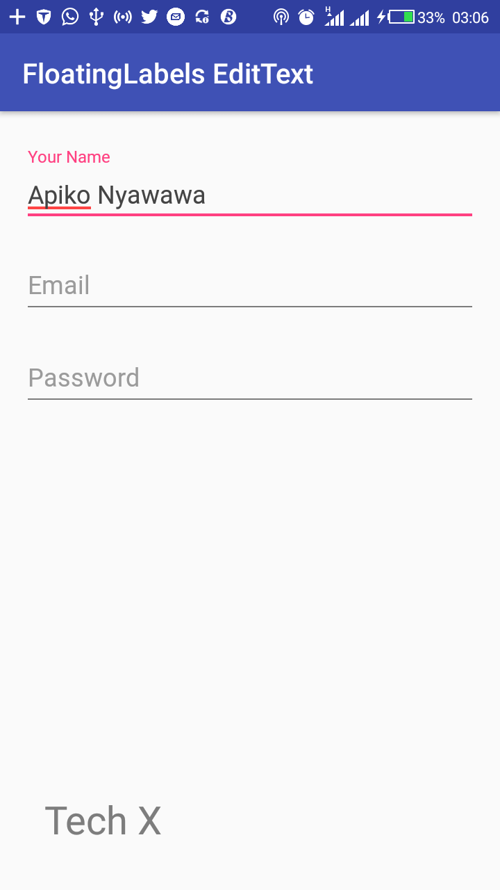
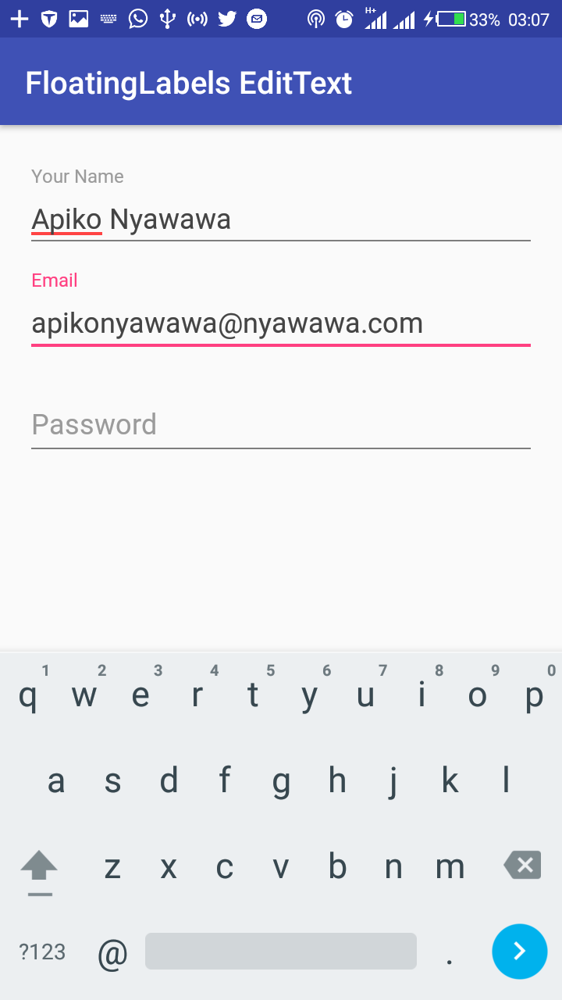
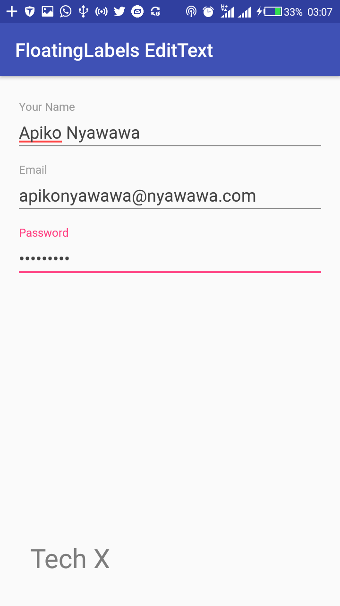

# FloatingLabels-EditText

 Quick guide on implementing android floating labels for EditText using design support library.
 
 Images
------

Setup Requirements
----------------

- 
Getting Started
----------------

In order to get the app running yourself, you need to:

1.  

Contributing
------------

I would ❤️  some contributions from other authors here. Just follow these steps

 - Fork this repository
 - Open a new issue with details about your blog post 
 - Send me a pull request with everything
 - 🤗  wait for my virtual hug

Get in touch - Let's become friends
-----------------------------------

Please feel free to contact me if you have any questions, ideas or even if you just want to say hi. I’m up for talking, exchange ideas, collaborations or consults. You can connect with me through any of the avenues listed below:

- [Twitter](https://twitter.com/Ngesa254)
- [Github](https://github.com/ngesa254)
- [Medium](https://medium.com/@ngesa254)
- [Facebook](https://web.facebook.com/marvinngesa)
- [LinkedIn](https://www.linkedin.com/in/engngesamarvin) 

Found this project useful? Support by clicking the ⭐️ button on the upper right of this page. ✌️

References
----------

-

